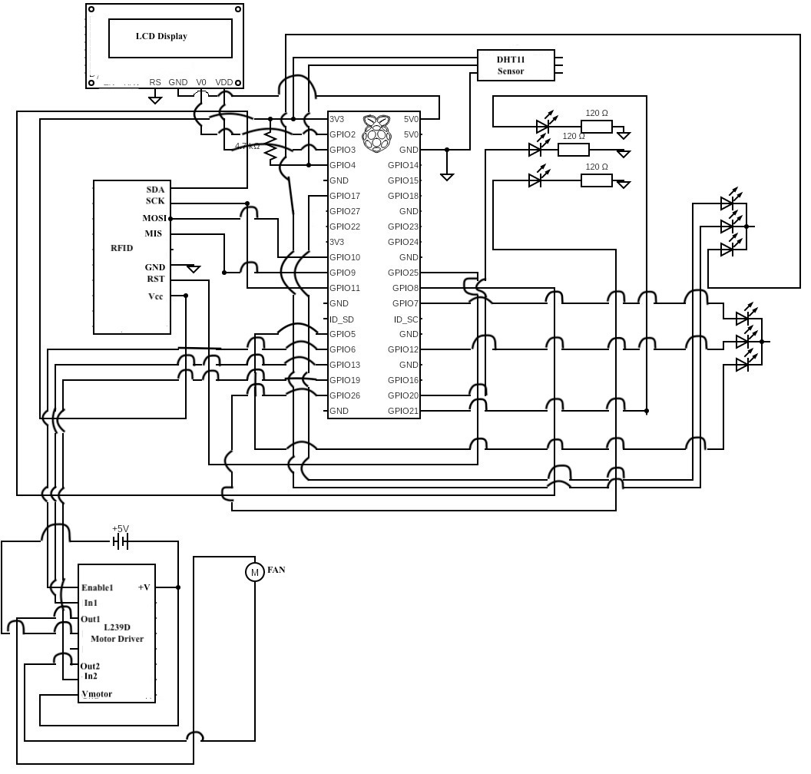

# Personalized Home Automation Pi

This is the Raspberry Pi controller code for the Personalized Home Automation project. This code works along with the Personalized Home Automation API which serves the endpoints, Personalized Home Automation Preferences Console to view and update preferences to set the preferences of a room according to the occupants set of preferences.

## Tools Required

This code works with the following hardware and software components

### Hardware

* RFID RC522
* DHT11 Temperature/Humidity Sensor
* 4-pin RGB LED Common Cathode * 2
* 20x4 LCD Display with i2c
* 9V DC motor
* L293D Motor Driver
* LED's and resistors (200 to 350 ohm)

### Software

The libraries required for this project are:

* RPi.GPIO, for interacting with GPIO pins
* mfrc522, to read and write values from and to RFID
* Adafruit-DHT, for reading values from the temperature and humidity sensor
* RPLCD, to display strings in the LCD screen
* paho-mqtt, to subscribe to preferences change published by the API
* python-decouple, to load envs

These along with their versions are listed in [requirements.txt](requirements.txt)

### Other resources

The program connects and subscribes to topics to listen and change settings according to preferences update in real time using MQTT. Fetching current room settings and updating user scan IN/OUT is acheived using the Personalized Home Automation API. See the installation and documentation links for these tools below.

* HiveMQ Broker 
    - [Installation and documentation](https://www.hivemq.com/downloads/hivemq/)

You will also need a running instance of Personalized Home Automation API.

* [Personalized Home Automation API](https://github.com/renjiniravath/personalized-home-automation-api)

## Environment Variables

The environment variables used by the API is listed in the .env file. Replace these values according to your environment. Refer the [.env](.env) file for info on the environment variables.

## Running

Run the below commands to start the program
```bash
sudo pip3 install -r requirements.txt
sudo python3 main.py
```
## Circuit Diagram

Following is the circuit diagram for the connection of room devices to the Raspberry Pi controller:



